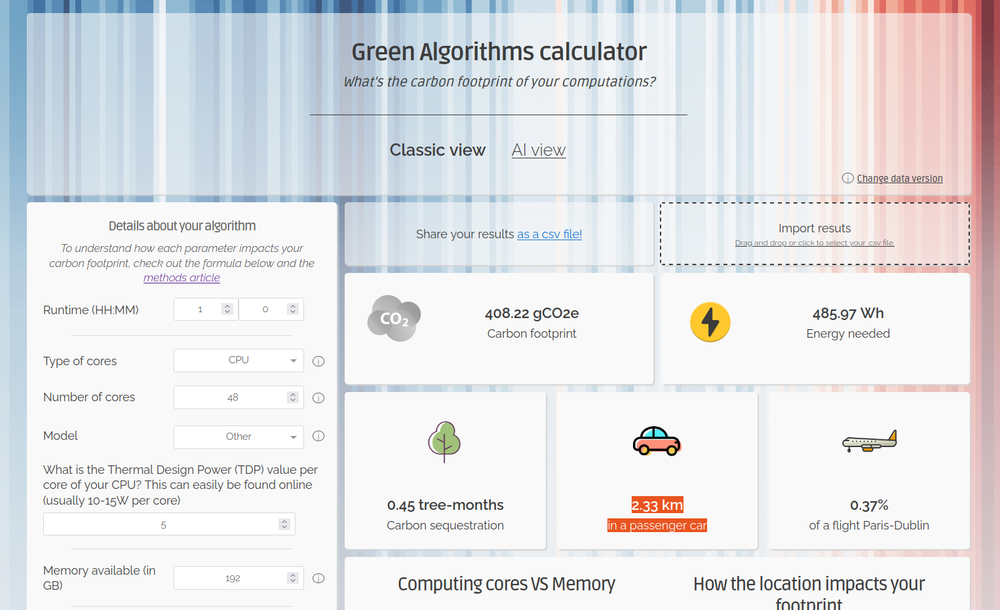

The [Green Algorithms calculator](https://calculator.green-algorithms.org/) allows you to calculate the carbon footprint for your computational activities, either during the project design phase or after.

It is getting common to see sustainability statements at the end of papers with information of the carbon footprint associated to the project, so this is a great tool for that.

Information needed:

-   Runtime

-   Type of cores

-   Number of cores

-   Model or the core power usage (TDP)

-   Memory in GB

-   Platform

-   Location

-   Real usage factor for the CPU –\> 1 if all core are active during runtime

-   Power Usage Efficiency of the data centre: is a standardised efficiency metric that measure the energy consumption of data centre overheads (e.g. cooling).

-   Multiplicative factor

So, for example if you where to run a job for 1 hour in gadi's Cascade Lake nodes will have:

-   Runtime: 01:00

-   Type of cores: CPU

-   Number of cores: 48 #Entire node

-   Model or the core power usage (TDP): the Cascade Lake node uses Xeon Platinum 8274 processors, with a **TDP of 240W**, meaning **5W per core.**

-   Memory in GB: 192 gb #Entire memory

-   Platform: Local Server

-   Location: Oceania, Australia

Without taking into account anything else, the carbon footprint calculated is 408.22 gCO2e, or 2.33 km in a passenger car.

Good news for those using gadi, [Australian Capital Territory uses 100% renewable energy since 2020](https://www.dw.com/en/australian-capital-canberra-journey-to-renewable-power/a-71694896). This means that the carbon footprint of running jobs in gadi and storing data is close to zero. Why not zero zero? Well, in this calculations we are not including the carbon footprint of producing (and later recycling) the hardware.

That gadi is located in ACT is still not an argument to no think about these issues. Calculating the potential carbon footprint of a research project can be useful in the design phase, when writing grants and also when reporting in a paper.
